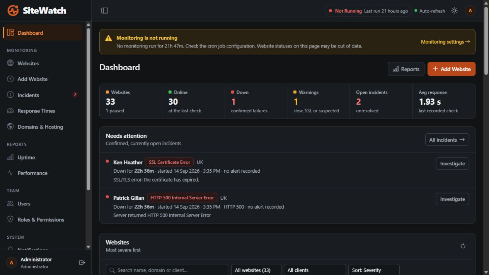
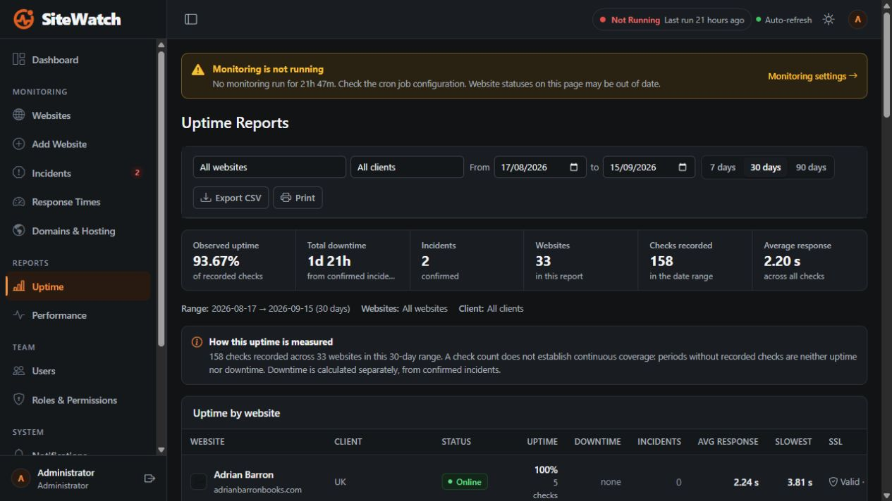
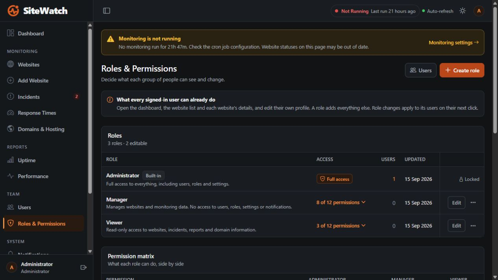
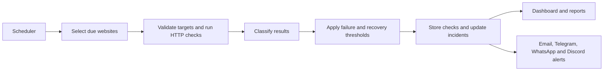

<div align="center">
  
  <h1>SiteWatch</h1>
  <p><strong>Every website. One clear view.</strong></p>
  <p>Self-hosted website monitoring for agencies, brands, and teams managing multiple websites.</p>
  <p>
    
    
    
    
  </p>
  <p>
    <a href="#screenshots">Screenshots</a> ·
    <a href="#features">Features</a> ·
    <a href="#quick-start">Quick start</a> ·
    <a href="docs/installation.md">Installation guide</a> ·
    <a href="#product-direction">Product direction</a>
  </p>
</div>



SiteWatch brings availability checks, SSL health, incidents, response times, domain information, and team access into one dashboard. Monitor public HTTP/HTTPS websites across different platforms, with additional detection for common WordPress failures—even when an error page returns HTTP 200.

Runs on PHP and MySQL with scheduled monitoring. Suitable for XAMPP development, Apache servers, and compatible cPanel hosting; no Node.js or Redis runtime required.

> **Current scope:** a self-hosted installation with a shared website portfolio and administrator-managed team accounts. Public signup, isolated customer workspaces, subscription billing, and a hosted Cloud service are proposed future work, not available features.

## Screenshots

Actual captures from the local application, taken on September 15, 2026. The example portfolio contains author websites; the application also accepts other public website URLs. These are historical interface examples, not live availability reports. The visible engine warning indicates that scheduled monitoring was stopped at capture time.

### Portfolio dashboard

See last-known website states, confirmed incidents, SSL warnings, and monitoring freshness together.

The dashboard preview above shows the current dark theme. The application also supports light mode and responsive layouts.

### Uptime reports

Filter by website, client, and date range. Review observed uptime, incident duration, recorded check counts, and response times, then export CSV or print.



### Roles and permissions

Manage Administrator, Manager, Viewer, and custom roles with server-side permission checks.



## Features

| Area | Available today |
| --- | --- |
| **Website portfolio** | Add and edit websites, CSV import/export, client labels, search, filters, sorting, pause/resume, and manual checks. |
| **Availability** | Scheduled HTTP/HTTPS checks; DNS, connection, timeout, redirect, HTTP, and SSL failure classification. |
| **WordPress diagnostics** | Detect critical errors, database connection failures, maintenance pages, and exposed PHP fatal errors. |
| **WordPress plugin** | Optional SiteWatch Connector: fatal errors with file, line and responsible plugin (no debug mode needed), daily health and security report, and a WordPress change log. |
| **Incident tracking** | Configurable consecutive-failure confirmation, recovery thresholds, incident history, and supporting diagnostics. |
| **Alerts** | Email through SMTP, Telegram, WhatsApp (free through GREEN-API or CallMeBot, or Meta’s Cloud API) and Discord webhooks; global and per-website alert controls, recovery notifications, and delivery logs. |
| **Performance & Core Web Vitals** | TTFB measured on every check; LCP, CLS, INP and Lighthouse scores for mobile and desktop through Google PageSpeed Insights, with historical trends. |
| **Website screenshots** | A periodic picture of each monitored site through a free rendering service, with history and on-demand capture. |
| **SSL monitoring** | Certificate checks, expiry information, and threshold-based expiry notifications. |
| **Domains and hosting** | RDAP/WHOIS registration details, domain expiry, nameservers, and hosting/CDN/network information where available. |
| **Reporting** | Observed uptime, response-time trends, performance reports, date/client/site filters, CSV exports, and print layouts. |
| **Team access** | Administrator-managed accounts, custom roles, permission matrix, profile management, and activity logs. |
| **Operations** | Monitoring heartbeat, stale-data notices, configurable retention, installation wizard, and database update screen. |
| **Interface** | Light/dark themes, responsive navigation, keyboard focus states, and automatic page refresh. |

**Know what a check means.** HTTP monitoring does not prove that login, checkout, or a contact form works. Browser-based customer journey testing is a future direction. Hosting information may identify a CDN rather than the origin server, and registry data can be unavailable.

## Quick start

### Requirements

- PHP **8.2+** with `pdo`, `pdo_mysql`, `curl`, `openssl`, `json`, and `mbstring`.
- MySQL **5.7+** or MariaDB **10.3+**.
- Apache with `.htaccess` support, or equivalent access restrictions on another server.
- Composer to install dependencies, and a scheduler capable of running PHP every minute.
- Outbound access to monitored websites and configured alert services. Frontend CDN assets require browser internet access.

### 1. Install dependencies

Download or clone this repository, open its directory, and run:

```bash
composer install --no-dev --optimize-autoloader
```

For local XAMPP development, put the project in `C:\xampp\htdocs\sitewatch` and start Apache and MySQL.

### 2. Run the installer

Open `/install.php` under your installation URL. For XAMPP:

```text
http://localhost/sitewatch/install.php
```

The wizard checks requirements, configures the database, creates your administrator account, and writes `.env` and the installation lock. Sign in with the account you created; no shared demo credentials are required.

### 3. Schedule monitoring

Run the monitor every minute. Replace the PHP and project paths with the absolute paths on your server:

```cron
* * * * * /usr/bin/php /var/www/sitewatch/cron/monitor.php >> /var/www/sitewatch/storage/logs/scheduler.log 2>&1
```

For Windows Task Scheduler, repeat every minute using:

```text
Program:   C:\xampp\php\php.exe
Arguments: C:\xampp\htdocs\sitewatch\cron\monitor.php
Start in:  C:\xampp\htdocs\sitewatch
```

A separate daily domain refresh is recommended:

```cron
45 4 * * * /usr/bin/php /var/www/sitewatch/cron/domain-check.php
```

The main monitor handles due checks, heartbeat recording, SSL refresh work, and scheduled cleanup. Opening the dashboard alone does not run scheduled website checks.

### 4. Add websites and alerts

Add a website or import a CSV, set its check interval, and configure any of the alert channels — SMTP, Telegram, WhatsApp or Discord — under **Notifications**. After the scheduler executes successfully, verify the engine indicator and last-check times.

See the [complete installation and operations guide](docs/installation.md) for cPanel deployment, environment variables, each alert channel, permissions, migrations, and troubleshooting.

## How monitoring works



Failures must meet the configured confirmation threshold before opening an incident. Recovery also requires consecutive successful checks. This reduces alerts caused by isolated failures. A monitoring heartbeat makes stopped or unhealthy scheduling visible in the interface.

### Observed uptime, explained

```text
Observed uptime = up checks / total recorded checks × 100
```

Checks in a confirmed failure streak count as down, including the initial failures once confirmation occurs. Paused periods and missing checks contribute no observations. **Missing data is neither uptime nor downtime.** Incident duration is reported separately from check-based uptime; these figures should not be treated as proof of continuous coverage.

## WordPress plugin (SiteWatch Connector)

External checks show *that* a site failed. The optional SiteWatch Connector plugin shows *why*: it runs inside
WordPress and pushes signed reports to SiteWatch.

- **Fatal errors with their cause**: message, file, line and the plugin or theme responsible, captured without
  `WP_DEBUG`. A must-use loader catches crashes that happen while other plugins load. Down alerts include the cause.
- **Daily health and security report**: versions, pending updates, plugins and themes, database size, scheduled
  tasks, modified core files, PHP files in uploads and risky settings.
- **Change log**: plugin/theme/core changes, administrator sign-ins, failed sign-in counts. New administrators and
  site address changes are alerted immediately.
- **Known vulnerabilities**: SiteWatch matches each site's plugins, themes and WordPress version against the free
  [WPVulnerability](https://www.wpvulnerability.com/) database (a few lookups per monitoring run, cached for a day;
  only component names and versions are sent, never the site). The server needs outbound HTTPS to
  `www.wpvulnerability.net`.
- **File watch**: changes to `wp-config.php` and `.htaccess` made outside WordPress are alerted; the contents never
  leave the site.

Set up per website: open the website → **WordPress** → **Download plugin**, install and activate it in WordPress,
click **Create connection key** in SiteWatch and paste the key under **Settings → SiteWatch** in WordPress.

Reports go from WordPress to `api/connector/ingest.php` every 5 minutes (WP-Cron), signed with HMAC-SHA256 using a
per-site secret stored encrypted with `APP_KEY`; SiteWatch never connects to the WordPress site. The plugin needs
PHP 7.2+ and WordPress 5.2+. Its version is set in `wordpress-plugin/sitewatch-connector/sitewatch-connector.php`;
SiteWatch shows an update notice when a site runs an older copy. Architecture, protocol, test setup and roadmap:
[docs/sitewatch-connector.md](docs/sitewatch-connector.md).

## Configuration and deployment

The installer creates `.env`; [`.env.example`](.env.example) documents the available environment settings. Runtime monitoring, alert, and retention settings are managed in the application.

- Use HTTPS and `APP_DEBUG=false` in production.
- Keep `.env`, `storage/`, and internal application directories inaccessible over HTTP. Apache protections are included; other servers need equivalent rules.
- Keep private-address monitoring disabled unless deploying inside a trusted internal network for that purpose.
- Back up the database and preserve `APP_KEY`; encrypted notification credentials depend on it.
- Apply database changes through **System → Updates**, or run `phpdatabase/migrate.php` after backing up.

See [security guidance](docs/installation.md#11-security-recommendations) and [troubleshooting](docs/installation.md#15-troubleshooting).

## Development

```bash
composer install
composer test
```

Additional scenario and lifecycle checks are described in the [testing guide](docs/installation.md#14-testing). Run database-backed lifecycle tests against a dedicated test installation.

```text
admin/               Dashboard and administration pages
api/                 Authenticated JSON endpoints
app/Core/            Authentication, permissions, configuration, database
app/Monitoring/      Checks, classification, incidents, scheduling, uptime
app/Performance/     Core Web Vitals (PageSpeed Insights) and screenshots
app/Domains/         RDAP, WHOIS, and hosting inspection
app/Notifications/   Email, Telegram, WhatsApp and Discord delivery
app/Repositories/    Database access
app/Services/        Application services
assets/              Styles, JavaScript, and branding
wordpress-plugin/    SiteWatch Connector WordPress plugin (served as a zip from each website page)
cron/                Monitoring and housekeeping entry points
database/            Schema and migration tools
docs/                Installation guide and screenshots
tests/               Unit, scenario, and lifecycle tests
```

### Versions and releases

SiteWatch uses [semantic versioning](https://semver.org/) and records every release in [CHANGELOG.md](CHANGELOG.md).
The running version and release notes appear under **System → Updates**, next to the database version.

To ship a release:

1. Add the release at the top of `Release::NOTES` in [`app/Core/Release.php`](app/Core/Release.php) and set `Release::VERSION`.
2. If it changes the database, add a step to [`App\Core\Migrator`](app/Core/Migrator.php) (`steps()`, `STEPS` with
   `'release' => 'x.y.z'`, and bump `VERSION`), update `database/schema.sql`, and set the release's `schema` number.
3. Add the same notes to `CHANGELOG.md`. `composer test` fails if the version, notes, changelog and schema disagree.
4. Deploy, then open **System → Updates** and click **Update database** if a schema change is pending.

## Product direction

The proposed direction is a general-purpose platform for agencies, brands, and multi-site teams, with a useful self-hosted edition and an optional managed service. These items are **not implemented commitments or release dates**:

- [ ] Public signup and onboarding.
- [ ] Isolated customer workspaces and workspace membership.
- [ ] Client/brand portfolios with scoped access.
- [ ] Durable monitoring jobs, notification retries, and usage limits.
- [ ] Managed Cloud deployment and subscription billing.
- [ ] Ready-made browser checks for important website actions.
- [ ] Regional monitoring and scheduled branded reports.
- [ ] Simplified self-hosted packaging and upgrades.

## Contributing

For bug reports, include the PHP/database versions, deployment environment, reproduction steps, and expected versus actual behavior. Remove credentials, tokens, personal data, and private URLs from logs and screenshots before sharing them.

Keep proposed changes focused, document configuration changes, and run relevant tests. Discuss larger architectural changes before implementation.

## License status

The current [`composer.json`](composer.json) declares `proprietary`, and this repository does not yet include an open-source license. An open-source edition is under consideration; this README does not change the licensing terms or grant open-source permissions.

---

<div align="center">
  <strong>SiteWatch</strong><br />
  Website health, incidents, and visibility for your whole portfolio.
</div>
